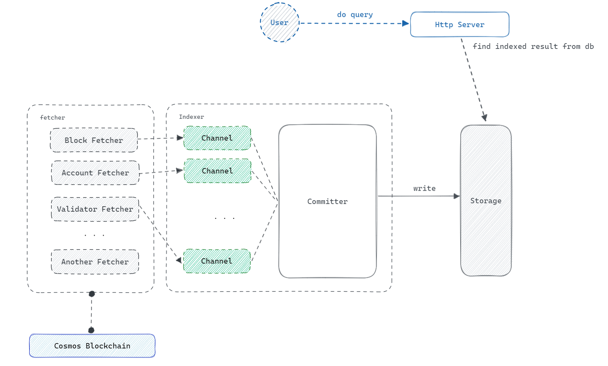

## System Design

* `Http Server` : This receives the request from the client and query the data from the `Storage` and gives back the response to the client.
* `Fetcher` : every fetcher consist of one or more goroutines 
and it sends a data to the channel of the `Committer`.
* `Committer` : it receives data from the channel and it convert data to the writable-format and commit to the storage.
* `Storage` : Persistent Storage